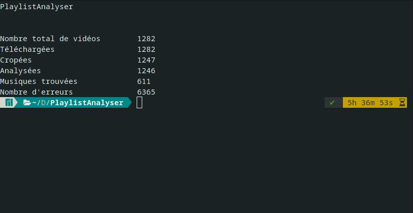

# Wankil music downloader

## Description
Tool to analyze music from youtube videos / playlists.

## First try
Bug ! Mais ok !
[Résultats](./Other/result.txt "Musiques trouvées lors de la 1ère exécution")


## TODO
- [ ] Commenter
- [ ] Ecran de chargement au début (particulièrement pour les chargement des grandes playlist)
- [ ] Plusieurs sons par extrait
- [ ] Ajouter une option pour pas save les sons en double
- [ ] Ajouter une option pour enregistrer les sons par vidéos
- [ ] Ajouter un timer
- [ ] Refaire l'interface
- [ ] Min et max pour le nombre de threads
- [ ] Ajouter les arguments pour rendre le code utilisable sans l'éditer
- [ ] Déplacer les vidéos à la fin si ClearCache == False
- [ ] Récupérer en 1er temps une playlist avec moins d'éléments pour commencer le multithreading plus tôt

## Bug
- [] Pourquoi 1282 au lieu de 650-692 ? (nombre de vidéos)

## Tool
Options tool
```
PlaylistAnalyser [options] URL
    -d, --download DIR          Save all songs in dir
    -s, --analyse-show          Analyse all musics and show all music used
    -a, --analyse-save FILE     Save all analyse in FILE
    -S, --start-at seconds      Audio saved & analysed start at "seconds" from start or from end if negative
    -E, --end-at seconds        Audio savec & analysed ends at "seconds" from start or from end if negative
    -a, --attempt INT           Number of attempts when errors
```
